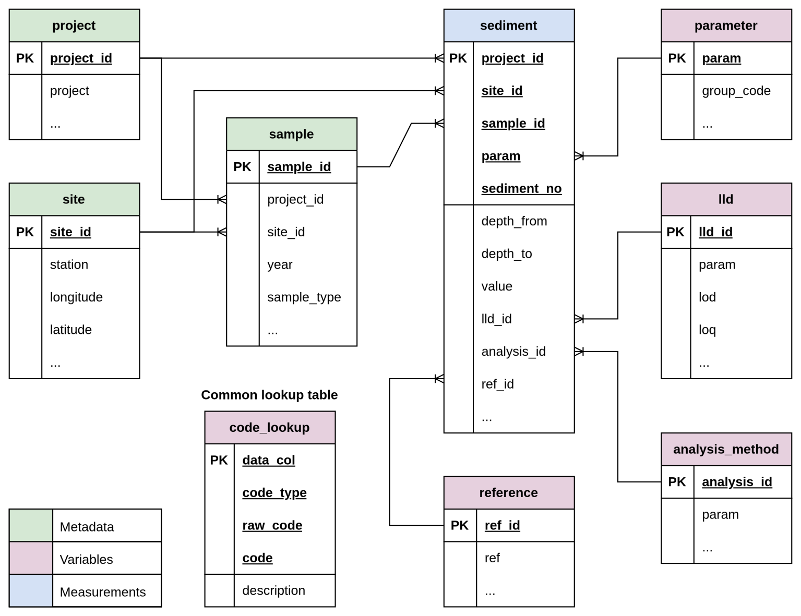

The page shows the database schema diagram along with table definitions based on the ICES-DOME dataset.

## DB Schema Diagram
The proposed database design shown in the ER (Entity Relationship) diagram below contains nine tables including three meta (entity) tables, five variable (look-up or reference) tables, and one fact (measurement) table.

The columns with `PK` in the diagram indicate primary keys of the table, which guarantees unique identifications.

{.zoomable}

## Project Table

The `project` table captures the unique combinations of monitoring programme,
purpose, country, and responsible institute that generated the data.

### Table Columns

```{r}
library(tibble)

tibble(
  Name = c(
    "project_id", "project", "purpose", "country", "institute"
  ),
  `Data Type` = c(
    "INTEGER", "TEXT", "TEXT", "TEXT", "TEXT"
  ),
  PK = c(
    "✓", "", "", "", ""
  ),
  FK = c(
    "", "", "", "", ""
  ),
  `NA Allowed` = c(
    FALSE, FALSE, TRUE, TRUE, TRUE
  ),
  Description = c(
    "Primary Key. Auto-generated surrogate key.",
    "Monitoring programme code(s), e.g. CEMP or CEMP~NATL.",
    "Purpose code(s), e.g. T~S (trend and surveillance).",
    "Country name of the responsible institute.",
    "Code for the reporting laboratory / institute (maps to RLABO in code_lookup)."
  )
)
```

---

## Site Table

The `site` table holds the geographical location of each sampling station.

### Table Columns

```{r}
tibble(
  `Name` = c(
    "site_id", "station", "longitude", "latitude",
    "dist_to_coast", "country", "country_code",
    "municipality", "sea_name"
  ),
  `Data Type` = c(
    "TEXT", "TEXT", "REAL", "REAL",
    "REAL", "TEXT", "TEXT",
    "TEXT", "TEXT"
  ),
  `PK` = c(
    "✓", "", "", "",
    "", "", "",
    "", ""
  ),
  `NA Allowed` = c(
    FALSE, FALSE, FALSE, FALSE,
    TRUE, TRUE, TRUE,
    TRUE, TRUE
  ),
  `Description` = c(
    "Primary Key. Auto-generated surrogate key.",
    "Station identifier code.",
    "Longitude coordinate (decimal degrees).",
    "Latitude coordinate (decimal degrees).",
    "Distance to the coast.",
    "Country name.",
    "Country code (e.g., NO).",
    "Municipality name.",
    "Name of the sea or coastal water body."
  )
)

```

---

## Sample Table

The `sample` table records one physical sampling event, linking a project,
site, and date together.

### Table Columns

```{r}
tibble(
  Name = c(
    "sample_id", "project_id", "site_id",
    "year", "date", "sample_type", "sample_type_description"
  ),
  `Data Type` = c(
    "INTEGER", "INTEGER", "INTEGER",
    "INTEGER", "TEXT", "TEXT", "TEXT"
  ),
  PK = c(
    "✓", "", "",
    "", "", "", ""
  ),
  FK = c(
    "", "project (project_id)", "site (site_id)",
    "", "", "", ""
  ),
  `NA Allowed` = c(
    FALSE, FALSE, FALSE,
    TRUE, TRUE, TRUE, TRUE
  ),
  Description = c(
    "Primary Key. Auto-generated surrogate key.",
    "Foreign Key to the project table.",
    "Foreign Key to the site table.",
    "Year of sampling.",
    "Full date of sampling (text, format DD/MM/YYYY).",
    "Sample type code, e.g. GC (grab/core) or DA (dab).",
    "Sample type description."
  )
)
```

---

## Code Lookup Table

The `code_lookup` table is a common lookup resource that maps every coded field
in the database to its human-readable description. It also handles multi-code
values (e.g. `T~S`) by storing one row per individual component code.

### Table Columns

```{r}
tibble(
  Name = c(
    "data_col", "code_type", "raw_code", "code", "description"
  ),
  `Data Type` = c(
    "TEXT", "TEXT", "TEXT", "TEXT", "TEXT"
  ),
  PK = c(
    "✓", "✓", "✓", "✓", ""
  ),
  FK = c(
    "", "", "", "", ""
  ),
  `NA Allowed` = c(
    FALSE, FALSE, FALSE, FALSE, TRUE
  ),
  Description = c(
    "Primary Key. Column name in the database that contains this code (e.g. purpose, qflag).",
    "Primary Key. Code type / domain from the ICES vocabulary (e.g. PURPM, QFLAG).",
    "Primary Key. The original raw value as it appears in the data (e.g. T~S).",
    "Primary Key. Individual split code derived from raw_code (e.g. T or S).",
    "Human-readable description of the individual code."
  )
)
```

---

## Parameter Table

The `parameter` table defines each chemical or physical property that is
measured, together with its parent parameter group.

### Table Columns

```{r}
tibble(
  Name = c(
    "param", "param_description",
    "group_code", "group_description"
  ),
  `Data Type` = c(
    "TEXT", "TEXT",
    "TEXT", "TEXT"
  ),
  PK = c(
    "✓", "",
    "", ""
  ),
  FK = c(
    "", "",
    "", ""
  ),
  `NA Allowed` = c(
    FALSE, TRUE,
    TRUE, TRUE
  ),
  Description = c(
    "Primary Key. ICES parameter code, e.g. HG, CD, GSMF2000.",
    "Full name or description of the parameter.",
    "Parameter group code, e.g. I-MET, P-PHY.",
    "Full name of the parameter group."
  )
)
```

---

## LLD Table

The `lld` table stores the Limit of Detection (LOD) and Limit of Quantification
(LOQ) values associated with specific parameter measurements.

### Table Columns

```{r}
tibble(
  Name = c(
    "lld_id", "param", "lod", "loq"
  ),
  `Data Type` = c(
    "INTEGER", "TEXT", "REAL", "REAL"
  ),
  PK = c(
    "✓", "", "", ""
  ),
  FK = c(
    "", "parameter (param)", "", ""
  ),
  `NA Allowed` = c(
    FALSE, FALSE, TRUE, TRUE
  ),
  Description = c(
    "Primary Key. Auto-generated surrogate key.",
    "Foreign Key to the parameter table.",
    "Limit of Detection value.",
    "Limit of Quantification value."
  )
)
```

---

## Analysis Method Table

The `analysis_method` table catalogues the combination of laboratory, storage,
pre-treatment, extraction, clean-up, and analytical technique used for each
parameter measurement.

### Table Columns

```{r}
tibble(
  Name = c(
    "analysis_id", "param", "labo",
    "metst", "metpt",
    "metps", "metcx", "metoa"
  ),
  `Data Type` = c(
    "INTEGER", "TEXT", "TEXT",
    "TEXT", "TEXT",
    "TEXT", "TEXT", "TEXT"
  ),
  PK = c(
    "✓", "", "",
    "", "",
    "", "", ""
  ),
  FK = c(
    "", "parameter (param)", "",
    "", "",
    "", "", ""
  ),
  `NA Allowed` = c(
    FALSE, TRUE, TRUE,
    TRUE, TRUE,
    TRUE, TRUE, TRUE
  ),
  Description = c(
    "Primary Key. Auto-generated surrogate key.",
    "Foreign Key to the parameter table.",
    "Analysing laboratory code.",
    "Sample storage method code.",
    "Pre-treatment method code.",
    "Sub-sampling method code.",
    "Extraction / clean-up method code.",
    "Analytical method code, e.g. ICP-MS, AAS-GF."
  )
)
```

---

## Reference Table

The `reference` table holds bibliographic or standard-method references cited
for specific analyses.

#### Table Columns

```{r}
tibble(
  Name = c(
    "ref_id", "ref", "ref_description"
  ),
  `Data Type` = c(
    "INTEGER", "TEXT", "TEXT"
  ),
  PK = c(
    "✓", "", ""
  ),
  FK = c(
    "", "", ""
  ),
  `NA Allowed` = c(
    FALSE, FALSE, TRUE
  ),
  Description = c(
    "Primary Key. Auto-generated surrogate key.",
    "Short reference code, e.g. EPA 6020 or ISO11885:2007.",
    "Full title or description of the reference document."
  )
)
```

---

## Sediment Table

The `sediment` table stores the actual measurement values. Each row represents
one parameter measurement from one physical sub-sample (sediment layer) within
a sampling event.

#### Table Columns

```{r}
tibble(
  Name = c(
    "project_id", "site_id", "sample_id", "param", "sediment_no",
    "depth_from", "depth_to", "value", "unit", "basis",
    "qflag", "vflag", "uncrt", "metcu",
    "sub_no", "dcflag",
    "lld_id", "analysis_id", "ref_id"
  ),
  `Data Type` = c(
    "INTEGER", "INTEGER", "INTEGER", "TEXT", "INTEGER",
    "REAL", "REAL", "REAL", "TEXT", "TEXT",
    "TEXT", "TEXT", "REAL", "TEXT",
    "TEXT", "TEXT",
    "INTEGER", "INTEGER", "INTEGER"
  ),
  PK = c(
    "✓", "✓", "✓", "✓", "✓",
    "", "", "", "", "",
    "", "", "", "",
    "", "",
    "", "", ""
  ),
  FK = c(
    "project (project_id)", "site (site_id)", "sample (sample_id)",
    "parameter (param)", "",
    "", "", "", "", "",
    "", "", "", "",
    "", "",
    "lld (lld_id)", "analysis_method (analysis_id)", "reference (ref_id)"
  ),
  `NA Allowed` = c(
    FALSE, FALSE, FALSE, FALSE, FALSE,
    TRUE, TRUE, TRUE, TRUE, TRUE,
    TRUE, TRUE, TRUE, TRUE,
    TRUE, TRUE,
    TRUE, TRUE, TRUE
  ),
  Description = c(
    "Primary Key. Foreign Key to the project table.",
    "Primary Key. Foreign Key to the site table.",
    "Primary Key. Foreign Key to the sample table.",
    "Primary Key. Foreign Key to the parameter table.",
    "Primary Key. Sequential sub-sample index within a sample–parameter combination.",
    "Upper depth of the sediment layer (m).",
    "Lower depth of the sediment layer (m).",
    "Measured concentration or numerical result.",
    "Unit of measurement, e.g. ug/kg or %.",
    "Basis of measurement code, e.g. D (dry weight).",
    "Data quality flag code (may be multi-value, e.g. <).",
    "Validity flag code.",
    "Measurement uncertainty.",
    "Concentration unit code for the reported value.",
    "Sub-sample number within the physical core.",
    "Data completeness flag code(s).",
    "Foreign Key to the lld table.",
    "Foreign Key to the analysis_method table.",
    "Foreign Key to the reference table."
  )
)

```
